<picture>
  <source media="(prefers-color-scheme: dark)" srcset=".github/assets/banner-dark.svg" />
  
</picture>

  
  
  

### `01` About

I fell in love with programming in 2021, learning C at the Federal University of Sergipe. Wanting to give my programs an interface, I found JavaScript and never stopped.

**Today I've been a full-stack developer for over 4 years**, building everything from interfaces to APIs and mobile apps.

- **Scalability, simplicity and speed** — what I aim for in every project
- **Well-structured AI works magic** — and I put it to use every day
- **Away from code** — rock music, games, and being the Dungeon Master at RPG tables

### `02` Stack

| Area            | Tools                                                                                                                                                                                                                                                                                                                                                                                                                                                                                                                                                                 |
| --------------- | --------------------------------------------------------------------------------------------------------------------------------------------------------------------------------------------------------------------------------------------------------------------------------------------------------------------------------------------------------------------------------------------------------------------------------------------------------------------------------------------------------------------------------------------------------------------- |
| `FRONT-END`     |      |
| `MOBILE`        |                                                                                                                                                                                                                                                                                                                                                        |
| `BACK-END`      |                                                                                                                                            |
| `DATA`          |                                                                                                                                                                                                                                                            |
| `INFRA & TOOLS` |                                                                                                                                                                              |

### `03` Contact

**Let's build something together.** I'm open to talking about projects, opportunities, or just swapping ideas — reach me at [willianigordeveloper@gmail.com](mailto:willianigordeveloper@gmail.com) or on [LinkedIn](https://www.linkedin.com/in/willian-igor-santos/).

---

See the full portfolio at <a href="https://willianigordeveloper.com">willianigordeveloper.com</a>
